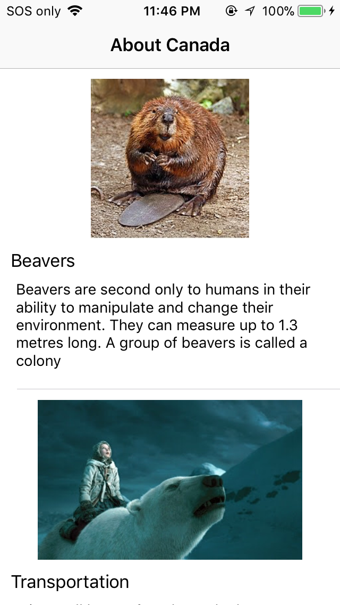

# QNAPhotoBrowser
This is a photo browser app.

## features

* Use GCD to download images from server.
* Use NSURLConnection framework
* Use programmatic auto layout
* Pull down to refresh data
* Support both iPhone and iPad

<<<<<<< HEAD

=======

>>>>>>> a7b26ba04080985040dee70c5a606627a9a5e4ed

## JSON Format
  ```
  {
  "title":"About Animal",
  "rows":[
	{
	"title":"Asian black bears",
	"description":"Asian black bears (Ursus thibetanus) live in southeast Asia and the Russian Far East.",
	"imageHref":"https://static.pexels.com/photos/35435/pexels-photo.jpg"
	},
   {
	"title":null,
	"description":null,
	"imageHref":null
	}
  ]
  }
  ```
## Installation

### CocoaPods

<<<<<<< HEAD

=======
>>>>>>> a7b26ba04080985040dee70c5a606627a9a5e4ed
Install the pods and open the .xcworkspace file to see the project in Xcode.

```
$ cd project-name
$ pod install
$ open project-name.xcworkspace
```
<<<<<<< HEAD

=======
>>>>>>> a7b26ba04080985040dee70c5a606627a9a5e4ed

## Runtime Requirements

 * iOS 8.0 or later
 * CocoaPods 
